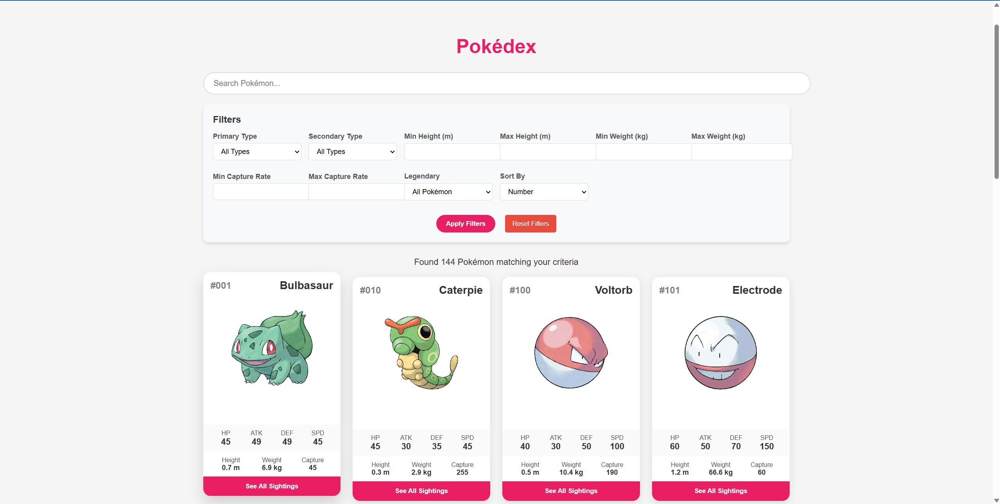
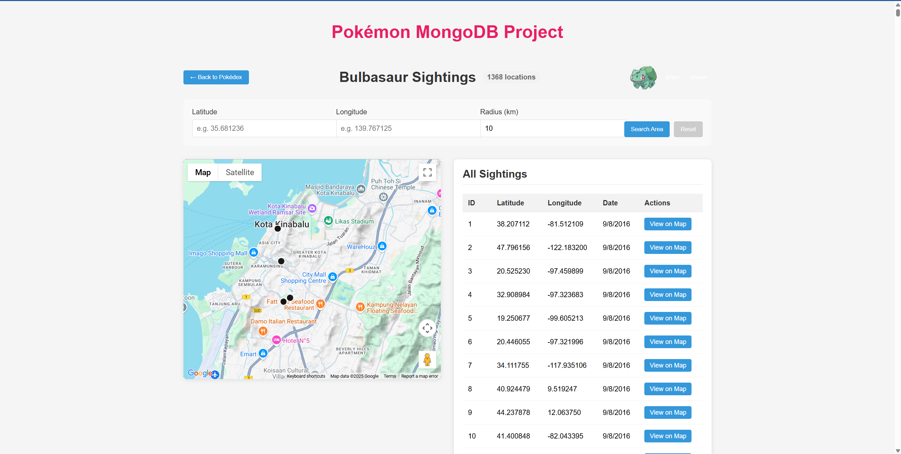
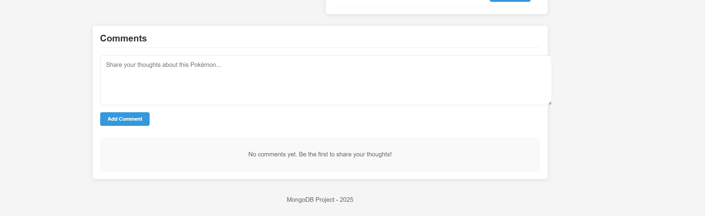
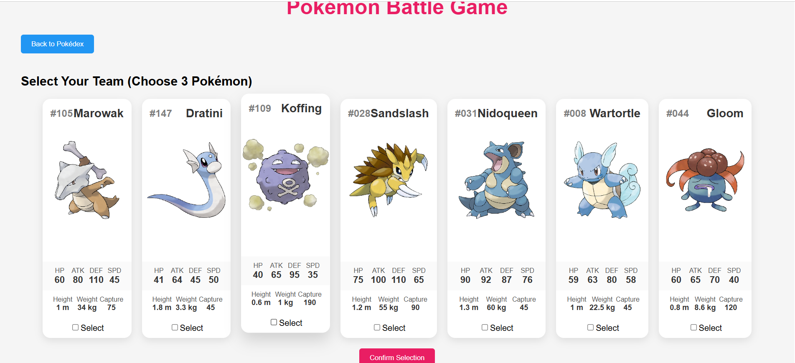

# Pokémon MongoDB Project

## About the Project

The Pokémon MongoDB Project is a full-stack web application that serves as an interactive Pokédex, a Pokémon sightings tracker, and a turn-based battle game. Built with React, Flask, and MongoDB, it allows users to explore detailed Pokémon stats, visualize real-world sightings on a Google Map, add comments, and engage in strategic Pokémon battles against a CPU opponent. This project leverages modern web technologies to create an engaging experience for Pokémon enthusiasts.

Key features include:

- **Pokédex**: A searchable and filterable interface displaying Pokémon stats (HP, Attack, Defense, etc.), types, height, weight, and more.
- **Sightings Map**: Visualize Pokémon sightings with custom coordinate and radius filtering using the Google Maps API.
- **Commenting System**: Share and view thoughts about specific Pokémon.
- **Pokémon Battle Game**: Select a team of 3 Pokémon and battle a CPU team in a turn-based system, with outcomes based on attack power and health.

## Project Structure

- **Frontend**: Built with React (`App.js`, `Pokedex.js`, `PokemonSightings.js`, `PokemonGame.js`) and styled with CSS (`Pokedex.css`, `PokemonSightings.css`, `PokemonGame.css`).
- **Backend**: Powered by Flask (`app.py`, `pokemon.py`, `game.py`, `images.py`) with MongoDB integration.
- **Database Setup**: Managed by a Python script (`pokemon_script.py`) that processes datasets and stores them in MongoDB.
- **Datasets**: Sourced from Kaggle, including Pokémon stats, sightings, and images.

## Technology Stack

Our project leverages the following technologies:

- **Frontend**:

  - **React**: Chosen for its component-based architecture, enabling reusable UI elements like Pokémon cards and dynamic state management for filtering and game logic.
  - **React Router**: Facilitates seamless navigation between Pokédex, sightings, and game pages.
  - **Axios**: Simplifies API calls to the Flask backend.
  - **Google Maps API**: Powers the interactive sightings map with geospatial visualization.

- **Backend**:

  - **Flask**: A lightweight Python framework ideal for rapid API development and MongoDB integration.
  - **Flask-CORS**: Manages cross-origin requests between the frontend and backend.

- **Database**:

  - **MongoDB**: Selected for its flexibility with unstructured data (e.g., sightings, stats, images) and native geospatial query support.
  - **PyMongo**: Provides Pythonic access to MongoDB for data loading and querying.
  - **GridFS**: Stores Pokémon images efficiently within MongoDB.

- **Data Processing**:
  - **Python**: Used for scripting (`pokemon_script.py`) due to its robust libraries for CSV parsing and MongoDB interaction.

We chose this stack for its synergy: React’s interactivity pairs well with Flask’s simplicity, and MongoDB’s document model accommodates the variety of our datasets. The Google Maps API was a natural fit for geospatial visualization, enhancing the sightings feature.

## Process

### Prerequisites

Ensure the following are installed:

- **MongoDB**: Running locally on port `27017`.
- **Python**: With `pymongo`, `gridfs`, and `flask` libraries.
- **React.js and npm**: For the frontend.
- **Git**: Optional, for cloning the project.

### Step 1: Download the Datasets

Download the required datasets from Kaggle:

1. **National Pokédex Dataset (Gen 1-9)**

   - **Link**: [National Pokédex Dataset](https://www.kaggle.com/datasets/tifekusimo/national-pokdex-dataset-gen1-gen9)
   - **File**: `pokemon_v2.csv`
   - **Description**: Stats for 1,025 Pokémon (Gen 1-9), excluding Mega/Primal forms.

2. **Predict'em All (Pokémon Sightings)**

   - **Link**: [Predict'em All Dataset](https://www.kaggle.com/datasets/semioniy/predictemall)
   - **File**: `300k.csv`
   - **Description**: ~293,000 sightings of Gen 1 Pokémon with coordinates and timestamps.

3. **Pokémon Images Dataset**
   - **Link**: [Pokémon Images Dataset](https://www.kaggle.com/datasets/kvpratama/pokemon-images-dataset)
   - **Folder**: Place images in `frontend/images/` as `<pokemonId>.png` (e.g., `16.png` for Pidgey).

### Step 2: Import Data into MongoDB

1. **Start MongoDB**: Ensure your MongoDB server is running locally with the default credentials (`admin:admin@localhost:27017`). Adjust credentials in the commands below if necessary.

2. **Import CSV Files**: Use mongoimport to load the datasets into the PokeMap database. Run these commands from your terminal:

   ```bash
   mongoimport --db PokeMap --collection PokemonSightings --file 300k.csv --headerline --type csv  -u admin -p admin --authenticationDatabase admin
   mongoimport --db PokeMap --collection PokemonStats --file pokemon_v2.csv --headerline --type csv -u admin -p admin --authenticationDatabase admin
   ```

- Replace file paths with the actual locations of `300k.csv` and `pokemon_v2.csv`

- Adjust `-u (username) and -p (password)` based on your MongoDB authentication setup.

3. **Prepare Images**: Move the downloaded Pokémon images into the `frontend/images/ folder`. Ensure each image is named as `<pokemonId>.png` (e.g., `16`.png for Pidgey).

4. **Create the PokeMap Database and User**: This project uses the mongoapp user with password huMONGOu5 for authentication. Open the MongoDB shell:

   ```bash
   mongosh -u {username} -p {password}
   ```

   Then run the following commands to switch to the PokeMap database:

   ```bash
     use PokeMap
   ```

   now run this command to create the new user:

   ```bash
    db.createUser({
    user: "mongoapp",
    pwd: "huMONGOu5",
    roles: [
        { role: "readWrite", db: "PokeMap" }
      ]
    })
   ```

- This creates a user `mongoapp` with read/write access to the `PokeMap` database
- Exit the shell with `exit`

5. **Run the Database Setup Script**: Execute `pokemon_script.py` to merge the datasets, store images in GridFS, and create the `MergedPokemonSightings` collection.

   If you are in the root dir switch to the `frontend/`

   ```bash
   cd frontend/
   ```

   Then run this in the cmd:

   ```bash
   python pokemon_script.py
   ```

   This script:

   - Connects to MongoDB and clears existing image data in GridFS.
   - Loads Pokémon stats into a dictionary.
   - Groups sightings by Pokémon ID.
   - Uploads images to GridFS and links them to Pokémon.
   - Creates a merged collection with Pokémon stats, sightings, and image references.

## Challenges Encountered

- **Data Cleansing**: 300k.csv had pokemonId as integers, but pokemon.py expected strings. We converted them in pokemon_script.py.
- **Performance**: Radius queries in PokemonSightings.js were slow; adding a 2dsphere index in pokemon.py resolved this.
- **Image Gaps**: Some Pokémon lacked images; we hsd to source the images from `Serebii.net`.
- **Merging**: Limited to 144 Gen 1 Pokémon due to sightings data constraints, requiring careful mapping in pokemon_script.py

## Volume

After running the script, connect to MongoDB (e.g., via MongoDB Compass or the mongo shell) and check the collections:

```bash

PokeMap> show collections
images.chunks
images.files
MergedPokemonSightings
PokemonSightings
PokemonStats
PokeMap> db.PokemonStats.countDocuments()
1024
PokeMap> db.PokemonSightings.countDocuments()
296021
PokeMap> db.MergedPokemonSightings.countDocuments()
144
PokeMap> db.images.files.countDocuments()
144
PokeMap> db.images.chunks.countDocuments()
144
PokeMap>

```

See the "Database Structure" section below for a sample document from each collection.

## Database Structure

The database (`PokeMap`) contains the following collections after setup:

1. `PokemonStats`

- **Description**: Raw Pokémon stats from `pokemon_v2.csv`.
- **Document Count**: ~1,024
- **Sample Document**:

```json

{
  "_id": ObjectId('67c9dba03597fdabc319596b'),
  "No": 1,
  "Name": "Bulbasaur",
  "name_url": "bulbasaur",
  "HP": 45,
  "Att": 49,
  "Def": 49,
  "S": {
    "Att": 65,
    "Def": 65
  },
  "Spd": 45,
  "PrimaryType": "grass",
  "SecondaryType": "poison",
  "Ability1": "Overgrow",
  "Ability2": '',
  "HiddenAbility": "Chlorophyll",
  "Generation": 1,
  "Male%": 88,
  "Female%": 12,
  "against_Normal": 1,
  "against_Fire": 2,
  "against_Water": 0.5,
  "against_Electric": 0.5,
  "against_Grass": 0.25,
  "against_Ice": 2,
  "against_Fight": 0.5,
  "against_Poison": 1,
  "against_Ground": 1,
  "against_Flying": 2,
  "against_Psychic": 2,
  "against_Bug": 1,
  "against_Rock": 1,
  "against_Ghost": 1,
  "against_Dragon": 1,
  "against_Dark": 1,
  "against_Steel": 1,
  "against_Fairy": 0.5,
  "Height (m)": 0.7,
  "Weight (kg)": 6.9,
  "Capture Rate": 45,
  "Base Happiness": 50,
  "Base Egg Steps": 2560,
  "Experience Growth": "Medium Slow",
  "mega_evolution": 0,
  "overall_legendary": 0
}

```

2. `PokemonSightings`

- **Description**: Raw sighting data from 300k.csv.
- **Document Count**: ~296,021
- **Sample Document**:

```json
{
  "_id": "NTgxMDkzOTk4MTM5MjUwMjIzNw==",
  "pokemonId": "16",
  "latitude": 20.525745,
  "longitude": -97.460829,
  "appearedLocalTime": "2016-09-08T03:57:45",
  "cellId_90m": 9645139108510564000,
  "cellId_180m": 9645139108711890000,
  "cellId_370m": 9645139108443455000,
  "cellId_730m": 9645139109517197000,
  "cellId_1460m": 9645139113812165000,
  "cellId_2920m": 9645139130992034000,
  "cellId_5850m": 9645138924833604000,
  "appearedTimeOfDay": "night",
  "appearedHour": 5,
  "appearedMinute": 57,
  "appearedDayOfWeek": "dummy_day",
  "appearedDay": 8,
  "appearedMonth": 8,
  "appearedYear": 2016,
  "terrainType": 14,
  "closeToWater": "false",
  "city": "Mexico_City",
  "continent": "America",
  "weather": "Foggy",
  "temperature": 25.5,
  "windSpeed": 4.79,
  "windBearing": 269,
  "pressure": 1018.02,
  "weatherIcon": "fog",
  "sunriseMinutesMidnight": 436,
  "sunriseHour": 7,
  "sunriseMinute": 16,
  "sunriseMinutesSince": 941,
  "sunsetMinutesMidnight": 1181,
  "sunsetHour": 19,
  "sunsetMinute": 41,
  "sunsetMinutesBefore": -196,
  "population_density": 2431.2341,
  "urban": "true",
  "suburban": "true",
  "midurban": "true",
  "rural": "false",
  "gymDistanceKm": 0.049869,
  "gymIn100m": "true",
  "gymIn250m": "true",
  "gymIn500m": "true",
  "gymIn1000m": "true",
  "gymIn2500m": "true",
  "gymIn5000m": "true",
  "pokestopDistanceKm": 0.081776,
  "pokestopIn100m": "true",
  "pokestopIn250m": "true",
  "pokestopIn500m": "true",
  "pokestopIn1000m": "true",
  "pokestopIn2500m": "true",
  "pokestopIn5000m": "true",
  "cooc_1": "true",
  "cooc_2": "false",
  "cooc_3": "false",
  //...
  "cooc_151": "false",
  "class": 16
}
```

3. `MergedPokemonSightings`

- **Description**: Merged data with one document per Pokémon, combining stats, sightings, and image references.
- **Document Count**: ~144 (reflects Gen 1 Pokémon with sightings)
- **Sample Document**:

```json

{
  "_id": ObjectId("67de5e80e65d6ed45054fcc9"),
  "pokemon": {
    "name": "Pidgey",
    "hp": 40,
    "attack": 45,
    "defense": 40,
    "primary_type": "normal",
    "secondary_type": "flying",
    "height": 0.3,
    "weight": 1.8,
    "capture_rate": 255,
    "legendary": false,
    "pokemonId": "16"
  },
  "sightings": [
    {
      "location": { "type": "Point", "coordinates": [-97.460829, 20.525745] },
      "date": "2016-09-08T03:57:45"
    },
    // ... 52,014 more sightings
  ],
  "comments": [],
  "image_path": ObjectId("67de5e7fe65d6ed45054fba9")
}

```

4. `images.files and images.chunks`

- **Description**: GridFS collections storing Pokémon images.
- **Sample images.files Document**:

```json

{
  "_id": ObjectId("67de5e7fe65d6ed45054fba9"),
  "filename": "16.png",
  "metadata": { "pokemon_id": "16" },
  "length": 61223,
  "uploadDate": ISODate("2025-03-22T06:53:51.140Z")
}

```

## Variety

Interesting search terms and interactions:

- **Pidgey**: Search in the Pokédex, Pidgey then click "See All Sightings" to view 52,000+ sightings worldwide on the map.
- **Fire** (Primary Type): Filter in Pokédex to see all Fire-types, then sort by "Attack" to find high-damage Pokémon like Charizard.
- **Coordinates (Sightings)**: Enter latitude: 35.6762, longitude: 139.6503 (Tokyo) with a 10km radius to see dense activity.
- **Pokemon Battle**: Click "Play Pokémon Battle Game" in Pokédex, choose three Pokémon, and watch them battle a CPU team.

## Bells and Whistles

Our group excelled in:

- **Battle Game**: We’re proud of the turn-based battle system (`PokemonGame.js`, `game.py`), where users select 3 Pokémon from 7 and fight a CPU team. The health (HP + Defense) and attack power (Attack + Speed/3) mechanics add strategy, distinguishing our project with gameplay beyond data visualization.
- **Interactive Map**: The sightings map (`PokemonSightings.js`) with custom radius filtering and info windows offers a polished, user-friendly experience.
- **Robust Filtering**: The Pokédex (`Pokedex.js`) supports multi-criteria filtering (type, stats, legendary) with debounced search, showcasing technical finesse.

## Running the Application

### Backend Setup

1. **Navigate to the Backend Directory**: Assuming you in the root folder use

   ```bash

   cd backend

   ```

2. **Install Dependencies**: Ensure you have Flask and other requirements installed. Create a requirements.txt if not already present with:

   ```text

   flask
   flask-cors
   pymongo

   ```

   Then run:

   ```bash

   pip install -r requirements.txt

   ```

3. **Start the Flask Server**:

   ```bash

   python app.py

   ```

   The server runs on `http://localhost:5000`

### Frontend Setup

1. **Navigate to the Frontend Directory**: Assuming you in the root folder use

   ```bash

   cd frontend

   ```

2. **Install Dependencies**:

   ```bash

   npm install

   ```

   This installs `React`, `react-router-dom`, `axios`, and other dependencies listed in `package.json`.

3. **Start the React App**:

   Either use this command

   ```bash

   npm start

   ```

   or

   ```bash

   $env:NODE_OPTIONS="--openssl-legacy-provider"; npm start

   ```

   The app runs on `http://localhost:3000`

### Accessing the App

Open your browser to `http://localhost:3000/pokedex`. You’ll see the Pokédex interface where you can filter Pokémon, view details, and explore sightings on a map.

## Screenshots

### Pokédex View

  
_Caption: The Pokédex interface showing Pokémon cards with stats and filters._

### Sightings Map

  
_Caption: A Google Map displaying Pokémon sightings with custom radius filtering._

### Comments Section

  
_Caption: The comments section for a specific Pokémon._

### Pokemon Battle Section


_Caption: The battle pokemon section._

## Future Enhancements

- Add support for all 1,025 Pokémon (currently limited to Gen 1 with sightings).
- Implement user authentication for personalized comments.
- Enhance map features with real-time sighting updates.

## Acknowledgments

- Datasets provided by Kaggle contributors.
- Pokémon data sourced from `Serebii.net`.
- Built as part of a MongoDB-focused project in 2025.
